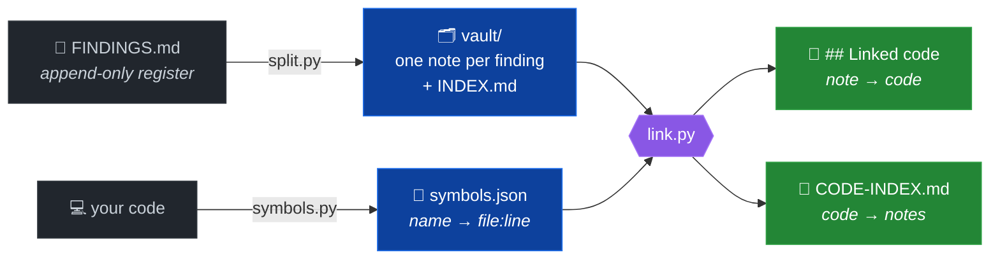

<h1 align="center">tracelink</h1>

<p align="center">
  Turn an append-only findings register into one note per finding —<br>
  and connect every note to the code it names, <b>file and line, both directions</b>.
</p>

<p align="center">
  
</p>

<p align="center">
  <a href="LICENSE"></a>
  
  
  
</p>

<p align="center">
  <sub>Works as a <a href="https://claude.com/claude-code">Claude Code</a> plugin,
  or as three standalone Python scripts.<br>
  By <b>Massimiliano Paragnani</b> — <a href="https://aosol.cloud">aosol.cloud</a></sub>
</p>

<p align="center">
  <b>Where this is going:</b> the long-term memory of AI-assisted coding —<br>
  file-based, tool-agnostic, verifiable. See <a href="ROADMAP.md">ROADMAP.md</a>.
</p>

---

## The problem

A findings register written by appending is the natural way to record things as
you learn them, and the worst possible way to read them later. After a few
sessions a single finding exists as several sections scattered through the file
in chronological order — its correction sitting between two sections of an
unrelated one. The story of any one finding can only be reconstructed by reading
the whole file.

And there is a second gap, which no register solves at all: **from a function,
what has already been discovered about it?** That question is asked constantly
while working in a codebase and nothing answers it. The knowledge exists, in
prose, unlinked.

## What it does



The register is never modified. `split.py` reads it; everything else works on the
vault.

Each note gains a `## Linked code` block:

```markdown
## Linked code

- `parse_payload` — src/ingest/parser.py:L88
- `ingest_batch` — src/ingest/batch.py:L142
```

And `CODE-INDEX.md` answers the reverse:

```markdown
| symbol | location | notes |
|---|---|---|
| `parse_payload` | src/ingest/parser.py:L88 | [[RES-01]] [[RES-07]] [[RES-11]] |
```

Three notes about one function is a signal worth seeing.

## Try it in thirty seconds

No install, no dependencies — the repository ships an example that exercises all
three scripts:

```console
$ python3 scripts/split.py --register examples/FINDINGS.example.md --out /tmp/tl --prefix RES
2 notes -> /tmp/tl
  closed=1  open=1

$ python3 scripts/symbols.py --repo examples/demo-project --backend scan --out /tmp/tl.json
3 symbols via scan -> /tmp/tl.json

$ python3 scripts/link.py --vault /tmp/tl --symbols /tmp/tl.json
notes_scanned:      2
notes_with_matches: 2
notes_modified:     2
symbols_linked:     3
distinct_symbols:   3
```

Open `/tmp/tl/INDEX.md`. **RES-02 is `open`** even though its body contains the
word `CLOSED` — it merely mentions RES-01's outcome. **RES-01 is `closed` with
severity `low`**, taken from its explicit `### STATUS:` / `### SEVERITY:`
headings. Those two lines are the whole reason the example exists.

## Install

**As a Claude Code plugin** — the repository is its own marketplace, so the
standard flow works directly:

```
/plugin marketplace add emmepi86/TraceLink
/plugin install tracelink@tracelink
```

The first command registers the marketplace declared in
`.claude-plugin/marketplace.json`; the second installs the plugin it lists. The
skill in `skills/tracelink/` comes with it.

**Standalone** — Python 3.11+, no dependencies. The PyPI package is
**`tracelink-vault`**; the installed command is still `tracelink`.

```bash
pipx install tracelink-vault  # or: pip install tracelink-vault
tracelink --help
```

> ⚠️ `pip install tracelink` (without `-vault`) installs an **unrelated
> third-party project** that happens to own that name on PyPI. This tool is
> published as `tracelink-vault`.

Or straight from the repository:

```bash
pipx install git+https://github.com/emmepi86/TraceLink
```

Or from a checkout, with nothing installed — the scripts work as they always
have:

```bash
git clone https://github.com/emmepi86/TraceLink
cd TraceLink
python3 scripts/symbols.py --help
```

## Use

```bash
# 1. symbol map: identifier -> file:line
tracelink index --repo /path/to/code --out symbols.json

# 2. register -> vault
tracelink split --register FINDINGS.md --out vault/ --prefix RES

# 3. cross-link, both directions, with a freshness check
tracelink link --vault vault/ --symbols symbols.json --repo /path/to/code
```

The original register is never modified. Linking is incremental: unchanged
notes are skipped outright (their rendered blocks are still byte-verified
against the cache, so hand edits are caught and repaired), which makes the
re-run after a code change cheap enough to automate — see below. `--full`
forces a complete pass.

Two more commands close the loop:

```bash
# one-shot health: register↔vault sync, index freshness, links, open+high
tracelink status --register FINDINGS.md --vault vault/ --symbols symbols.json
tracelink status ... --strict          # CI form: exit 1 on any problem

# never run steps 1+3 by hand again: refresh on every commit
tracelink hook install                  # writes .git/hooks/post-commit
tracelink hook status | remove
```

`status` estimates nothing: what it cannot establish it reports as unknown.
The git hook is marker-delimited, coexists with hooks you already have, and
never blocks a commit. Inside Claude Code, the plugin does the same job
without git: edits mark the vault stale, the end of the turn refreshes it.

Hotspots come for free: `CODE-INDEX.md` lists the symbols with two or more
notes and per-file rollups — the fragile places surface by themselves.

### Symbol backends

Tried in order, first one that produces symbols wins. Force with `--backend`.

| backend | source | notes |
|---|---|---|
| `graphify` | `graphify-out/graph.json` | richest — call edges, communities, SQL tables. Run [graphify](https://github.com/Graphify-Labs/graphify) `update` first |
| `ctags` | `tags` file | most portable. `ctags -R --fields=+n -f tags .` |
| `scan` | the source tree | always available. Python, JS/TS, Go, Rust, Java, Ruby, PHP, C/C++, SQL |

The backend is pluggable on purpose. The linker needs exactly one fact — where a
name lives — and coupling to a single upstream schema is how a small tool breaks
when someone else's project changes shape.

## Design decisions worth knowing

They all follow from one line, set out in [DESIGN_PRINCIPLES.md](DESIGN_PRINCIPLES.md):

> **No conclusion may carry more certainty than the evidence it came from.**


**tracelink never reads its own output.** Frontmatter and the managed block, delimited by
`<!-- tracelink:linked-code:start -->` and `:end`, are stripped before matching. Without
this the tool matches itself: 0.1.0's demo linked both example notes to
`severity`, a function inside `split.py`, and reported "2/2 notes linked" — a
statistic that was formally correct and substantively false. It also made links
immortal, since a symbol removed from the prose was rediscovered in the block
written by the previous run.

**Status comes from a finding's own headings, never its body**, on word
boundaries, and the last explicit value wins. Substring matching classified
`UNRESOLVED` as closed because it contains `RESOLVED`, and a finding CLOSED then
REOPENED stayed closed. Prefer the explicit grammar — `### STATUS: CLOSED`,
`### SEVERITY: MEDIUM` — the free-form keywords are a legacy fallback. A note reading
"this already caused a withdrawn finding (X-16)" is not itself withdrawn.
Keyword-matching the whole blob gets this wrong, and a wrong status in an index
is worse than no status, because an index is trusted at a glance. The example in
`examples/` exists to demonstrate exactly this case.

**Linking is lexical, and that is a real limit.** It finds identifiers a note
spells out. It will not know that "the enrichment channel" means
`enrich_records()` unless the note says so. Notes that name their symbols get
linked; prose that talks around them does not. This is stated here rather than
left for you to discover — and it is a good reason to name symbols when writing
findings.

**An ambiguous symbol is never guessed.** A name defined in two places is not
evidence for either, so tracelink reports both locations and links neither.
Resolve it by naming the qualified form (`payments.validate`), mentioning the
path in the note, or overriding it in the note's frontmatter:

```yaml
---
tracelink:
  validate: src/payments.py
---
```

**Links are capped, because generic names are noise.** `data`, `status`,
`record` and friends match modules and tables everywhere. `--max-links`
(default 8) and `--min-len` (default 7) control it, and a name inside backticks
bypasses the length filter — writing `` `id` `` is a deliberate reference, the
bare word is not.

**Three different properties, and the README used to blur them.**

| property | question |
|---|---|
| provenance | which repository and configuration produced this index? |
| freshness | does it still correspond to the current tree? |
| completeness | did the scan cover everything it should have? |

`tracelink link --repo . --freshness require` refuses to link against an index
that is stale, or one whose freshness cannot be established.

**Re-run after code changes.** A stale symbol map points notes at lines that have
moved, with nothing to indicate anything is wrong. Steps 1 and 3 are cheap;
wire them into a hook or a make target.

## What this is not

It does not read your code semantically, rank findings, or tell you what to fix.
It removes one specific friction: knowing where a finding lives in the code, and
what has already been found about the code in front of you.

The heavy lifting on the code side is done by graphify or ctags, both excellent
and both credited above. What is here is the join between findings and code, and
a convention for treating engineering findings as first-class artefacts —
versioned, with status and severity, linked to what they describe, instead of
buried in a document nobody reopens.

## Licence

Apache-2.0 — see [LICENSE](LICENSE).

Apache rather than MIT for the explicit patent grant: it makes the boundary of
what is and is not granted clear, instead of leaving it to implied-licence
arguments. It is equally permissive — use it inside proprietary software freely.

## Write linkable findings

Linking is lexical. tracelink connects notes to the symbols they **spell out**;
it does not infer them from prose. This is a contract, not a limitation to work
around:

```text
vague prose            -> few, unreliable links
explicit identifiers   -> strong links
contradictory evidence -> ambiguity, reported rather than guessed
```

Weak:

> The narrative pipeline mishandles negations.

Strong:

> `derive_patient_concepts()` mishandles negations before
> `apply_exclusion_rules()` runs.

Best:

> `concepts.derive_patient_concepts()` in `src/concepts/derive.py` mishandles
> negations before `rules.apply_exclusion_rules()`.

A qualified name survives a common stem: `cancel` alone is weak evidence in a
codebase with twenty of them, `watchdog.cancel` is not.

`tracelink link --report-unlinked` names every note that connected to nothing,
and says which of these it is: no identifiers at all, candidates filtered as too
common, or only ambiguous ones. Those three call for different fixes.

