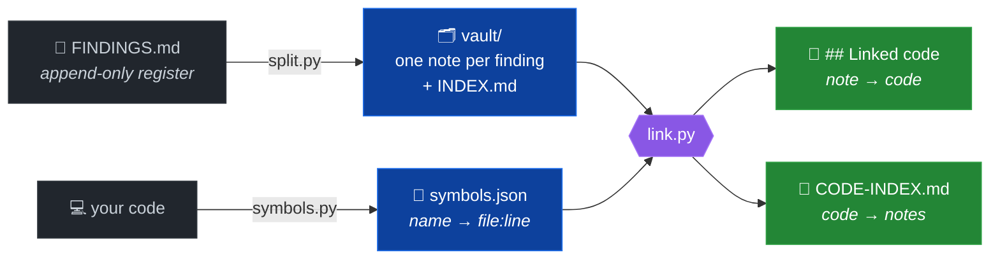

<h1 align="center">tracelink</h1>

<p align="center">
  Turn an append-only findings register into one note per finding —<br>
  and connect every note to the code it names, <b>file and line, both directions</b>.
</p>

<p align="center">
  
</p>

<p align="center">
  <a href="LICENSE"></a>
  
  
  
</p>

<p align="center">
  <sub>Works as a <a href="https://claude.com/claude-code">Claude Code</a> plugin,
  or as three standalone Python scripts.<br>
  By <b>Massimiliano Paragnani</b> — <a href="https://aosol.cloud">aosol.cloud</a></sub>
</p>

---

## The problem

A findings register written by appending is the natural way to record things as
you learn them, and the worst possible way to read them later. After a few
sessions a single finding exists as several sections scattered through the file
in chronological order — its correction sitting between two sections of an
unrelated one. The story of any one finding can only be reconstructed by reading
the whole file.

And there is a second gap, which no register solves at all: **from a function,
what has already been discovered about it?** That question is asked constantly
while working in a codebase and nothing answers it. The knowledge exists, in
prose, unlinked.

## What it does



The register is never modified. `split.py` reads it; everything else works on the
vault.

Each note gains a `## Linked code` block:

```markdown
## Linked code

- `parse_payload` — src/ingest/parser.py:L88
- `ingest_batch` — src/ingest/batch.py:L142
```

And `CODE-INDEX.md` answers the reverse:

```markdown
| symbol | location | notes |
|---|---|---|
| `parse_payload` | src/ingest/parser.py:L88 | [[RES-01]] [[RES-07]] [[RES-11]] |
```

Three notes about one function is a signal worth seeing.

## Try it in thirty seconds

No install, no dependencies — the repository ships an example that exercises all
three scripts:

```console
$ python3 scripts/split.py --register examples/FINDINGS.example.md --out /tmp/tl --prefix RES
2 notes -> /tmp/tl
  closed=1  open=1

$ python3 scripts/symbols.py --repo scripts --backend scan --out /tmp/tl.json
11 symbols via scan -> /tmp/tl.json

$ python3 scripts/link.py --vault /tmp/tl --symbols /tmp/tl.json
forward: 2/2 notes linked
backward: 1 symbols -> /tmp/tl/CODE-INDEX.md
```

Open `/tmp/tl/INDEX.md`. **RES-02 is `open`** even though its body says RES-01 was
closed — that one line is the whole reason the example exists.

## Install

**As a Claude Code plugin** — clone anywhere and point Claude Code at it; the
skill in `skills/tracelink/` is picked up from the plugin manifest.

**Standalone** — clone and run the scripts. Python 3.8+, no dependencies.

```bash
git clone https://github.com/emmepi86/TraceLink
cd TraceLink
```

## Use

```bash
# 1. symbol map: identifier -> file:line
python3 scripts/symbols.py --repo /path/to/code --out symbols.json

# 2. register -> vault
python3 scripts/split.py --register FINDINGS.md --out vault/ --prefix RES

# 3. cross-link, both directions
python3 scripts/link.py --vault vault/ --symbols symbols.json
```

The original register is never modified.

### Symbol backends

Tried in order, first one that produces symbols wins. Force with `--backend`.

| backend | source | notes |
|---|---|---|
| `graphify` | `graphify-out/graph.json` | richest — call edges, communities, SQL tables. Run [graphify](https://github.com/Graphify-Labs/graphify) `update` first |
| `ctags` | `tags` file | most portable. `ctags -R --fields=+n -f tags .` |
| `scan` | the source tree | always available. Python, JS/TS, Go, Rust, Java, Ruby, PHP, C/C++, SQL |

The backend is pluggable on purpose. The linker needs exactly one fact — where a
name lives — and coupling to a single upstream schema is how a small tool breaks
when someone else's project changes shape.

## Design decisions worth knowing

**Status comes from a finding's own headings, never its body.** A note reading
"this already caused a withdrawn finding (X-16)" is not itself withdrawn.
Keyword-matching the whole blob gets this wrong, and a wrong status in an index
is worse than no status, because an index is trusted at a glance. The example in
`examples/` exists to demonstrate exactly this case.

**Linking is lexical, and that is a real limit.** It finds identifiers a note
spells out. It will not know that "the enrichment channel" means
`enrich_records()` unless the note says so. Notes that name their symbols get
linked; prose that talks around them does not. This is stated here rather than
left for you to discover — and it is a good reason to name symbols when writing
findings.

**Links are capped, because generic names are noise.** `data`, `status`,
`record` and friends match modules and tables everywhere. `--max-links`
(default 8) and `--min-len` (default 7) control it, and a name inside backticks
bypasses the length filter — writing `` `id` `` is a deliberate reference, the
bare word is not.

**Re-run after code changes.** A stale symbol map points notes at lines that have
moved, with nothing to indicate anything is wrong. Steps 1 and 3 are cheap;
wire them into a hook or a make target.

## What this is not

It does not read your code semantically, rank findings, or tell you what to fix.
It removes one specific friction: knowing where a finding lives in the code, and
what has already been found about the code in front of you.

The heavy lifting on the code side is done by graphify or ctags, both excellent
and both credited above. What is here is the join between findings and code, and
a convention for treating engineering findings as first-class artefacts —
versioned, with status and severity, linked to what they describe, instead of
buried in a document nobody reopens.

## Licence

Apache-2.0 — see [LICENSE](LICENSE).

Apache rather than MIT for the explicit patent grant: it makes the boundary of
what is and is not granted clear, instead of leaving it to implied-licence
arguments. It is equally permissive — use it inside proprietary software freely.
